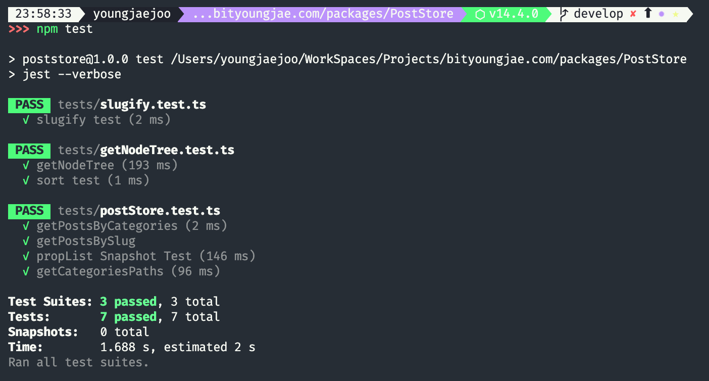
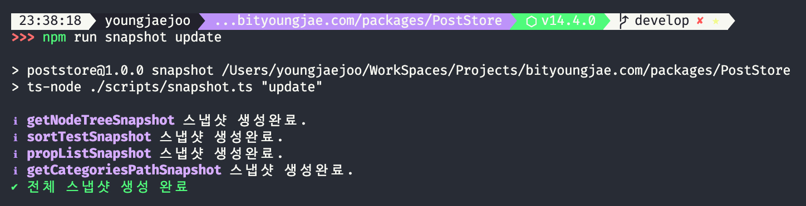
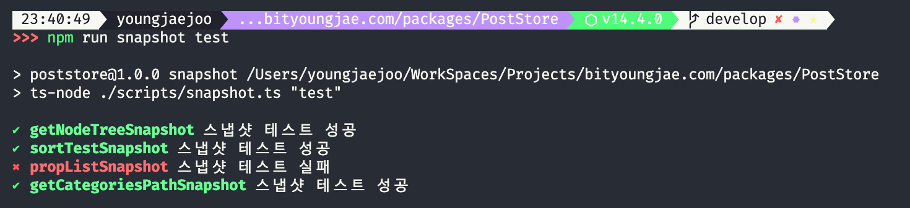
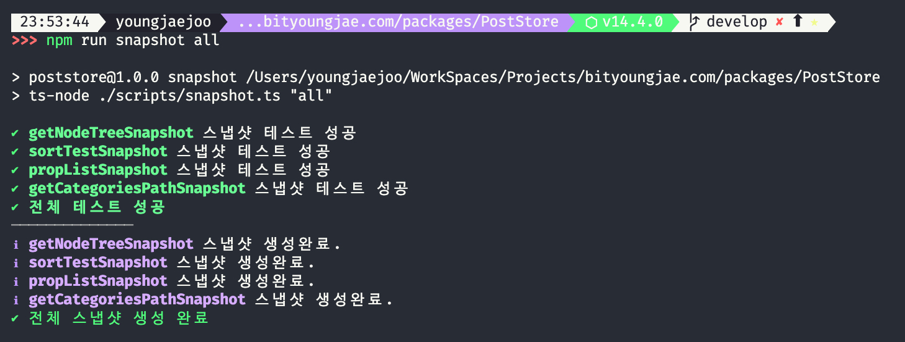

# PostStore

PostStore는 NEXT.JS와 함께 마크다운 기반 블로그를 만들기 위한 도구입니다.

## 테스트

## jest 단위 테스트

```bash
npm test
```



### 스냅샷 테스트

- 스냅샷 링크 : [스냅샷 디렉터리](tests/snapshot)
- 스냅샷 테스트 함수 목록 : [스냅샷 함수들](scripts/snapshotLIst/list.ts)

```bash
npm run snapshot update
```



```bash
npm run snapshot test
```



```bash
npm run snapshot all
```



## 주요 기록

### 2020-07-03

- 게시물 이름이 중복되는 경우에 대한 핸들링 추가.
  - 중복될 경우 hash를 붙이되, hash는 우선 경로 단위, 동일 경로에도 중복이 발생될 경우 salt를 늘려가며 재귀적 변경.
  - [관련 코드 링크](src/postParser.ts#L108-L128)
  - [스냅샷 링크](tests/snapshot/etc/duplicatedNames.snapshot.json)
- Multiple Store 기능 추가
  - 서로 다른 경로를 갖는 다수의 store 를 생성함으로써, 하나의 프로젝트에서 다수의 서브 페이지를 생성할 수 있게됨.
  - 하나의 프로젝트에서 블로그 관련, 기술 문서 관련 store를 별개로 생성해 관리 가능.
  - `perPageOption` 추가. 리스트 페이지 별로 페이지 당 게시물 출력 수를 각각 지정 가능.

#### 현재 기준 구현된 Configuration

```ts
interface PostStoreConfig {
  storeOption: {
    [key: string]: {
      path: string;
      shouldUpdate: boolean;
      incremental: boolean;
      perPage: {
        category: number;
        tag: number;
        page: number;
      };
      pageParam: {
        post: string;
        category: string;
        tag: string;
        page: string;
      };
    };
  };
}
```

### 2020-07-02

- 증분 빌드 초안 구현 ([src/utils/incrementalBuild.ts](src/utils/incrementalBuild.ts))
- 개발 모드 식별을 위한 환경변수 `isDev` 추가 ([src/common.ts](src/common.ts))
- tsConfig 기준 code quality 관련 옵션 추가 및 해당 옵션에 맞는 코드 리팩터링 진행.
- 카테고리 순서와 게시물 순서의 일관성을 유지하기 위해 트리 생성시 정렬 기능 추가.
  - [src/utils/getNodeTree.ts 코드](src/utils/getNodeTree.ts#L82-L115)
  - [sortTest 스냅샷 링크](tests/snapshot/tree/sortTest.snapshot.json)
- 스냅샷 테스트 관련 cli 추가

### 2020-07-01

**`PostStore` 를 별도의 모듈로 분리하였습니다.**

- `store` 생성 과정에서 `postData`에 대한 확장을 진행.
- `store`를 통해 생성된 `propList.post`의 경우 반환하는 `postData`에 대해 아래의 추가적인 확장 정보를 갖는다.
  - `relatedPosts` -> 카테고리 단위의 연관 게시물 목록
  - `prevPost`, `nextPost` -> 각각 카테고리 단위로 이전과 이후의 게시물의 `{title, slug}`를 갖는다.
  - `categories` -> 최하위 카테고리가 배열 형태로 저장된다. ex : `['javascript', '특별-시리즈']`
- 테스트 개선
  - 스냅샷 테스트를 별도의 유틸로 분리함.
  - `store.propList` 및 `getNodeTree` 스냅샷 테스트 추가
    - [getNodeTree 스냅샷 링크](tests/snapshot/tree/fileTree.snapshot.json)
    - [propList.global 스냅샷 링크](tests/snapshot/propList/global.snapshot.json)
    - [propList.category 스냅샷 링크](tests/snapshot/propList/category.snapshot.json)
    - [propList.tag 스냅샷 링크](tests/snapshot/propList/tag.snapshot.json)
    - [propList.page 스냅샷 링크](tests/snapshot/propList/page.snapshot.json)
    - [propList.post 스냅샷 링크](tests/snapshot/propList/post.snapshot.json)

### 2020-06-30

- postStore 구조 정립 및 하기 내용 구현완료
  - store.pathList
    - store.pathList.post -> getStaticPaths에 사용될 게시물 path list
    - store.pathList.category -> getStaticPaths에 사용될 category의 path list
    - store.pathList.tag -> getStaticPaths에 사용될 tag path list
    - store.pathList.page -> getStaticPaths에 사용될 page path list
  - store.propList
    - store.propList.category -> getStaticProps에 사용될 category의 prop list
    - store.propList.tag -> getStaticProps에 사용될 tag prop list
    - store.propList.page -> getStaticProps에 사용될 page prop list
    - store.propList.post -> getStaticProps에 사용될 post prop list
  - store.propList.global -> 각종 전역 데이터
    - store.propList.global.postCount -> 전체 게시물 갯수
    - store.propList.global.categoryCount -> 전체 category 갯수
    - store.propList.global.tagCount -> 전체 tag 갯수

### 2020-06-29

- 트리 탐색을 위한 헬퍼 함수들 작성함.
  - visit.tsx
    - visit 함수
    - findNode 함수
    - findeNodeAll 함수
- postStore 초안 구현완료
  - getCategoriesPath 함수
    - next.js에서 category 관련 path를 생성하기 위한 목적.
  - getPostsByCategories 함수
    - 카테고리 배열로부터 해당 카테고리에 속한 포스트들을 가져오기 위한 목적.

### 2020-06-25

- rehype용 prism.js 플러그인 제작함
  - prism.js로 하이라이트된 코드를 정적 생성하기 위한 플러그인임.
- postParser 초기 구현 완료
- 간단한 형태의 slugify 모듈 제작함.
- lib/getNodeTree.tsx 구현 완료
  - posts 폴더를 스캔하여 하부 디렉터리를 카테고리로 하위 마크다운 파일을 포스트로 하는 트리를 생성한다.
  - [테스트 디렉터리](tests/testPosts)
  - [스냅샷 링크](tests/snapshot/tree/fileTree.snapshot.json)
